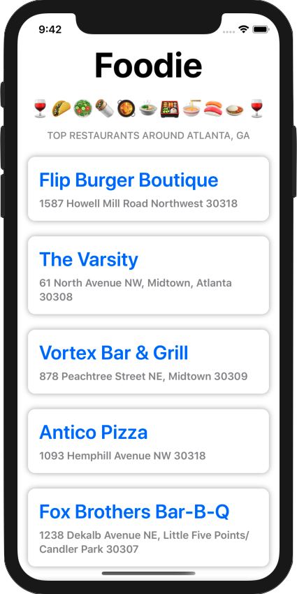
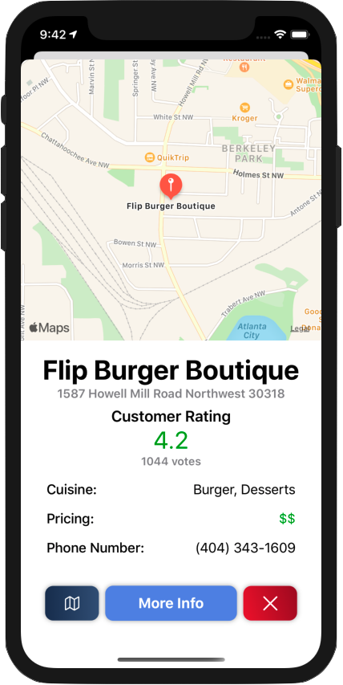

# Foodie🍴

Foodie helps you find the best restaurants in your current area. Powered by the Zomato API, it presents up to date location on an interactive map, average customer rating, and other important information about each restaurant.

   
   
   

## Key Features
* Displays the best restaurants in your area as determined by the Zomato API 
* The restaurant cards can be clicked to reveal more information about the restaurants in a modal
* An interactive map of the restaurant's location, the address, average customer rating, type of cuisine, pricing, and phone number are available for each restaurant in the modal 
* More information can be viewed from the Zomato Website by clicking on the **More Info** button
* The driving directions from your location to the restaurant can be easily set up through Apple Maps by clicking on the **map icon button**

## Technologies Used
This app is created using SwiftUI. All of the restaurant data is fetched from the Zomato API. The maps in the restaurant information modal are created using the Apple MapKit.

## Run on your personal Mac
To run this project on your local machine, clone the project to your desired folder, and open **Foodie.xcodeproj**. In the project navigator, you will find a file named **Constants.swift**. You will need to enter a Zomato API key into this file where it says **"Enter API Key Here"**. To get an api key, head to the [Zomato API Page](https://developers.zomato.com/api) and click on the **Generate API Key** button. The project should now work on your local machine 🥳    
   
🍷🌮🥗🌯🥘 Happy Dining 🍱🍜🍣🍛🍷
